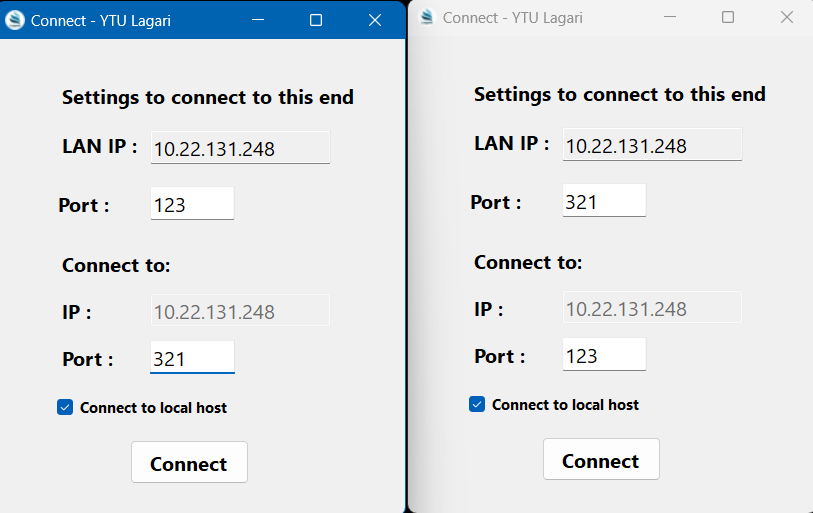

## Bağlantı ekranı
* Bu ekranda bağlanmak istediğimiz IP'yi, portu ve kendi dinlemek istediğimiz portu seçiyoruz.

## Mesajlaşma ekranı
* Bu ekranda bağlandığımız tarafın mesajlarını alıyoruz ve biz mesaj gönderebiliyoruz.

